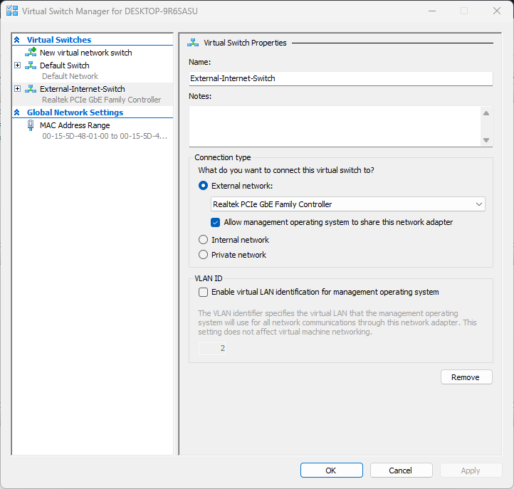

# Windows Server 2022 Home Lab

## Overview
This repository serves as a technical portfolio documenting my hands-on implementation and administration of a Windows Server 2022 environment. It features a comprehensive documentation of the practical steps, configurations, and system deployments managed during this project.

## Tech Stack
*  **Hypervisor:** Microsoft Hyper-V
*  **OS:** Windows Server 2022

## Lab Implementation

### Phase 1: Virtual Infrastructure & Environment Setup
In this phase, the core virtualization environment was prepared using Microsoft Hyper-V to host the Windows Server instances.

1. **Networking Configuration:**
   - Created a Virtual Switch: `External-Internet-Switch` (Type: External) to provide internet connectivity to the VMs.

2. **Virtual Machine Provisioning:**
   - **VM 01 (Domain Controller):**
     - **Name:** `Home-Lab-DC1-Server_2022`
     - **Memory:** 4096 MB
     - **OS:** Windows Server 2022 Datacenter (Desktop Experience)
   - **VM 02 (Member Server):**
     - **Name:** `Home-Lab-SVR1-Server_2022`
     - **Memory:** 3072 MB
     - **OS:** Windows Server 2022 Datacenter (Desktop Experience)

3. **System Optimization:**
   - **Checkpoints Disabled:** I have intentionally disabled the checkpoint feature for both virtual machines as they are not required for the current phase of the lab. 
   - **Note:** While I am aware that checkpoints (snapshots) are a powerful tool for recovering from configuration errors.

### Visual Proof of Setup

#### 1. Networking & Hyper-V Management
| Hyper-V Manager Overview | Virtual Switch Configuration | 
|---|---|
|  |  |

#### 2. Virtual Machine Specifications
* **DC1 Configuration:**
  
  
* **SVR1 Configuration:**
  
  

#### 3. System Access (Live Demo)
> Below is a quick capture of the successful login process:

  <video src="assets/login-demo.mp4" width="100%" controls title="Lab Demo"></video>

