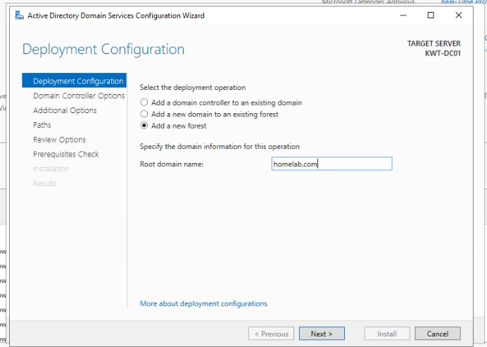
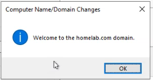

# Windows Server 2022 Home Lab

## Overview
This repository serves as a technical portfolio documenting my hands-on implementation and administration of a Windows Server 2022 environment. It features a comprehensive documentation of the practical steps, configurations, and system deployments managed during this project.

## Tech Stack
*  **Hypervisor:** Microsoft Hyper-V
*  **OS:** Windows Server 2022

## Lab Implementation

### Phase 1: Virtual Infrastructure & Environment Setup
In this phase, the core virtualization environment was prepared using Microsoft Hyper-V to host the Windows Server instances.

1. **Networking Configuration:**
   - Created a Virtual Switch: `External-Internet-Switch` (Type: External) to provide internet connectivity to the VMs.

2. **Virtual Machine Provisioning:**
   - **VM 01 (Domain Controller):**
     - **Name:** `Home-Lab-DC1-Server_2022`
     - **Memory:** 4096 MB
     - **OS:** Windows Server 2022 Datacenter (Desktop Experience)
   - **VM 02 (Member Server):**
     - **Name:** `Home-Lab-SVR1-Server_2022`
     - **Memory:** 3072 MB
     - **OS:** Windows Server 2022 Datacenter (Desktop Experience)

3. **System Optimization:**
   - **Checkpoints Disabled:** I have intentionally disabled the checkpoint feature for both virtual machines as they are not required for the current phase of the lab. 
   - **Note:** While I am aware that checkpoints (snapshots) are a powerful tool for recovering from configuration errors.

### Visual Proof of Setup

#### 1. Networking & Hyper-V Management
| Hyper-V Manager Overview | Virtual Switch Configuration | 
|---|---|
|  |  |

#### 2. Virtual Machine Specifications
* **DC1 Configuration:**
  
  
* **SVR1 Configuration:**
  
  

#### 3. System Access (Live Demo)
> Below is a quick capture of the successful login process:

## 🌐 Phase 2: Active Directory & Domain Integration

### 1️⃣ Network Infrastructure (Static Configuration)
To establish a stable identity environment, I configured static IP addresses. The critical step was pointing the Member Server's DNS to the Domain Controller.

#### **Primary Domain Controller (KWT-DC01)**
* **IP Address:** `192.168.8.100`
* **Subnet Mask:** `255.255.255.0`
* **Default Gateway:** `192.168.8.1`
* **Preferred DNS:** `127.0.0.1` (Self-reference)

---

#### **Member Server (KWT-SVR01)**
* **IP Address:** `192.168.8.101`
* **Subnet Mask:** `255.255.255.0`
* **Default Gateway:** `192.168.8.1`
* **Preferred DNS:** `192.168.8.100` (Pointing to DC)

---

### 2️⃣ AD DS Promotion (KWT-DC01)
I installed the **Active Directory Domain Services** role and promoted the server to a Domain Controller within a new forest.

* **Root Domain Name:** `homelab.com`
* **Forest Function Level:** Windows Server 2016 (Standard for compatibility)

---

### 3️⃣ Joining the Domain (KWT-SVR01)
The member server was integrated into the `homelab.com` domain. This process verifies that DNS resolution is working correctly between the two virtual machines.

**A. Initiating the Join:**

**B. Successful Domain Welcome:**

---

### 4️⃣ Post-Configuration Verification
To confirm the lab's health, I verified the computer objects in AD and performed a domain-level login.

#### **Active Directory Users & Computers (ADUC)**
I confirmed that `KWT-SVR01` is correctly populated within the **Computers** container.

#### **🎬 Demonstration: Domain Admin Login**
The following GIF shows the login process on `KWT-SVR01` using the `HOMELAB\Administrator` account, proving the domain's authority over the member server.

