# Windows Server 2022 Home Lab

## Overview
This repository serves as a technical portfolio documenting my hands-on implementation and administration of a Windows Server 2022 environment. It features a comprehensive documentation of the practical steps, configurations, and system deployments managed during this project.

## Tech Stack
*  **Hypervisor:** Microsoft Hyper-V
*  **OS:** Windows Server 2022

## Lab Implementation

### Phase 1: Virtual Infrastructure & Environment Setup
In this phase, the core virtualization environment was prepared using Microsoft Hyper-V to host the Windows Server instances.

1. **Networking Configuration:**
   - Created a Virtual Switch: `External-Internet-Switch` (Type: External) to provide internet connectivity to the VMs.

2. **Virtual Machine Provisioning:**
   - **VM 01 (Domain Controller):**
     - **Name:** `Home-Lab-DC1-Server_2022`
     - **Memory:** 4096 MB
     - **OS:** Windows Server 2022 Datacenter (Desktop Experience)
   - **VM 02 (Member Server):**
     - **Name:** `Home-Lab-SVR1-Server_2022`
     - **Memory:** 3072 MB
     - **OS:** Windows Server 2022 Datacenter (Desktop Experience)

3. **System Optimization:**
   - **Checkpoints Disabled:** I have intentionally disabled the checkpoint feature for both virtual machines as they are not required for the current phase of the lab. 
   - **Note:** While I am aware that checkpoints (snapshots) are a powerful tool for recovering from configuration errors.

### Visual Proof of Setup

#### 1. Networking & Hyper-V Management
| Hyper-V Manager Overview | Virtual Switch Configuration | 
|---|---|
|  |  |

#### 2. Virtual Machine Specifications
* **DC1 Configuration:**
  
  
* **SVR1 Configuration:**
  
  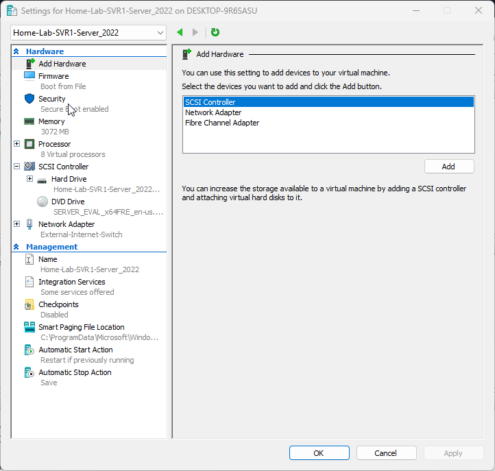

#### 3. System Access (Live Demo)
> Below is a quick capture of the successful login process:

---

### Phase 2: Active Directory Domain Services & Network Integration
In this phase, I established the identity foundation by promoting the primary Domain Controller and integrating the member server into the `homelab.com` forest.

1. **Network Standardization:**
   - Assigned static IPv4 addresses to ensure persistent DNS resolution between the servers.
   - **KWT-DC01 (Domain Controller):**
     - **IP:** `192.168.8.100` | **Preferred DNS:** `127.0.0.1` (Loopback)
   - **KWT-SVR1 (Member Server):**
     - **IP:** `192.168.8.101` | **Preferred DNS:** `192.168.8.100` (Pointing to DC1)

2. **Domain Controller Promotion:**
   - **Role Installation:** Deployed Active Directory Domain Services (AD DS) role.
   - **Forest Creation:** Established a new forest: `homelab.com`.
   - **Identity Update:** Finalized the server hostname as `KWT-DC01`.

3. **Domain Integration (Join Process):**
   - **Server Naming:** Updated the member server hostname to `KWT-SVR01`.
   - **Domain Join:** Successfully joined `KWT-SVR01` to the `homelab.com` domain.
   - **Authentication:** Verified the join using Domain Administrator credentials.

### Visual Proof of Domain Setup

#### 1. Networking & Static IP Configuration
| KWT-DC01 Network Settings | KWT-SVR01 DNS Pointing | 
|---|---|
| 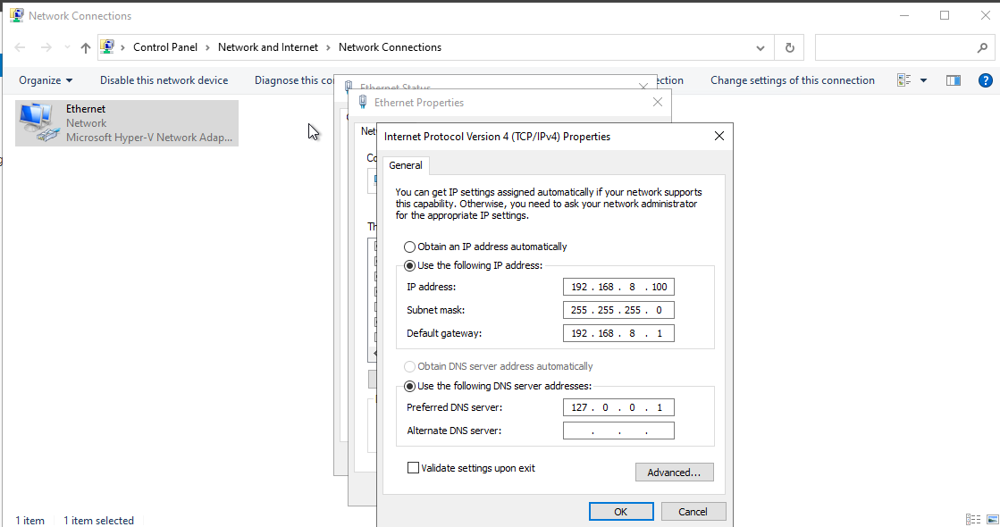 | 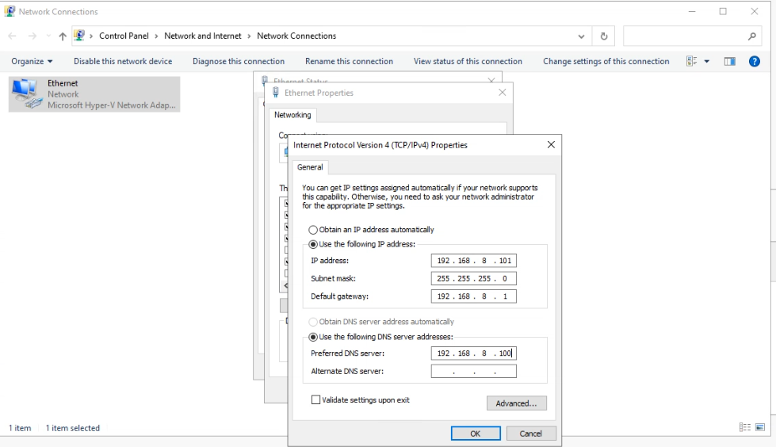 |

#### 2. Active Directory Configuration & Domain Join
* **Forest Deployment (`homelab.com`):**
  
  

* **Initiating Domain Join & Success:**

| Initiating Join | Success Message |
|---|---|
| 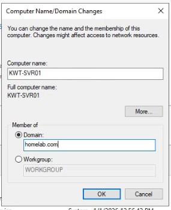 |  |
  
#### 3. Directory Verification & Identity (Live Demo)
* **Active Directory Users and Computers (ADUC):**
  > Verification of `KWT-SVR01` registration within the "Computers" container:
  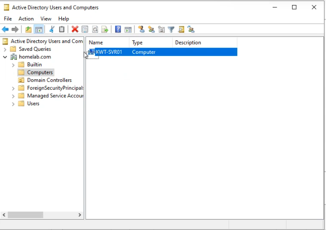

* **Domain Admin Access:**
  > Below is a capture of the successful login on the member server using the Domain Administrator account (`HOMELAB\Administrator`):
  

---

### Phase 3: Implementing High Availability (Additional Domain Controller)
In this phase, I promoted **KWT-SVR01** from a Member Server to an **Additional Domain Controller (ADC)**. This step is crucial for ensuring redundancy, load balancing, and fault tolerance within the `homelab.com` domain.

###  Execution Steps:

1. **Deployment Configuration:** Selected "Add a domain controller to an existing domain" using the `homelab.com` credentials.

   

3. **Domain Controller Options:** Enabled the **Global Catalog (GC)**. 
   > **Note on DNS:** For this lab, the DNS role was not installed on the ADC to rely on the Primary DC's centralized DNS.
   
   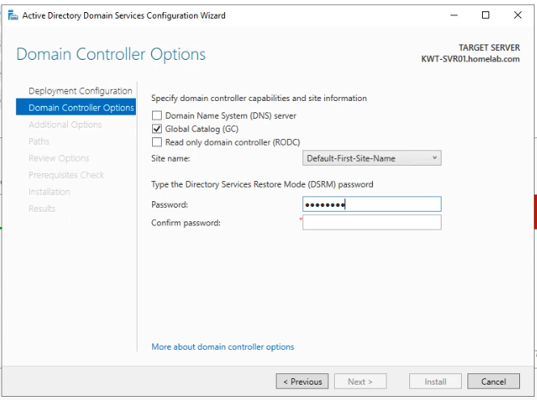

5. **Replication Strategy:** Used the "Any domain controller" option. Since there is currently only one Primary DC, the system automatically sourced the AD database from **KWT-DC01**.

   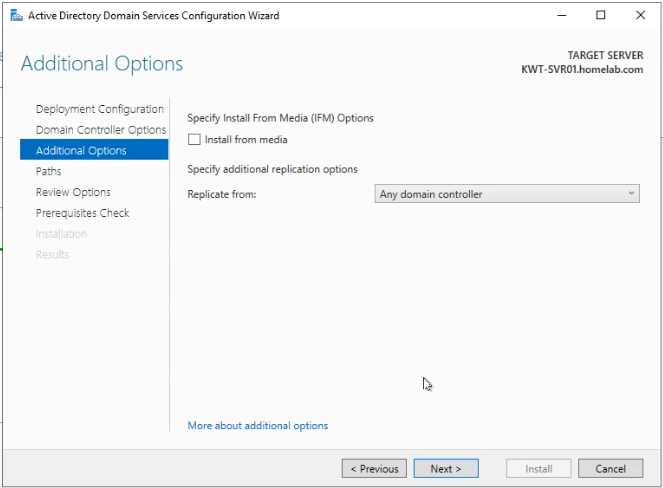

7. **Prerequisites Check:** All checks passed successfully, ensuring the environment was ready for the promotion.

   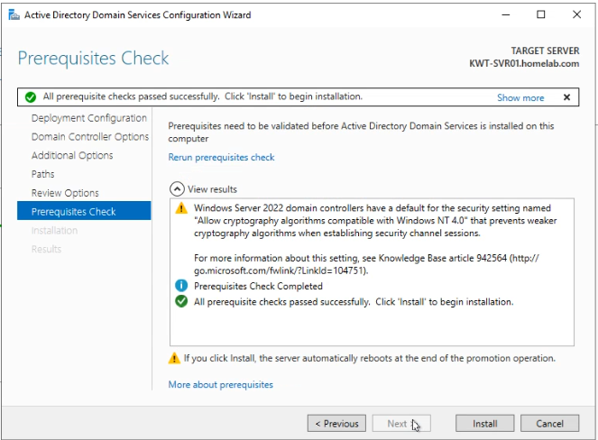

###  Final Verification:
After the promotion and mandatory reboot, **KWT-SVR01** now appears correctly under the **Domain Controllers** container in Active Directory Users and Computers (ADUC), alongside the Primary DC.

---

> **💡 Technical Insight (Production vs. Lab):**
> While this lab uses a simplified DNS and replication setup, in a **Production Environment**, the best practice is to install DNS on all domain controllers for High Availability and to explicitly define replication partners.

---

### Phase 4: DNS Infrastructure & External Resolution

In this phase, I configured the DNS services for **homelab.com** to handle external internet resolution and simulate professional inter-domain communication between organizations.

### 1. External DNS Forwarders
* **Configuration**: Added Google Public DNS (8.8.8.8) as the primary forwarder on **kwt-DC01**.
* **Benefit**: Ensures the lab environment can resolve external addresses more reliably than using default Root Hints.

### 2. Conditional Forwarders (Inter-Domain Simulation)
* **Configuration**: Established a **Conditional Forwarder** for a partner domain (`partner.com`).
* **Scenario**: This simulates a real-world enterprise setup where our DNS server is taught exactly where to send queries for a specific partner organization’s network.

### Screenshots
| DNS Forwarders Setup | Conditional Forwarder Configuration |
|---|---|
|  | 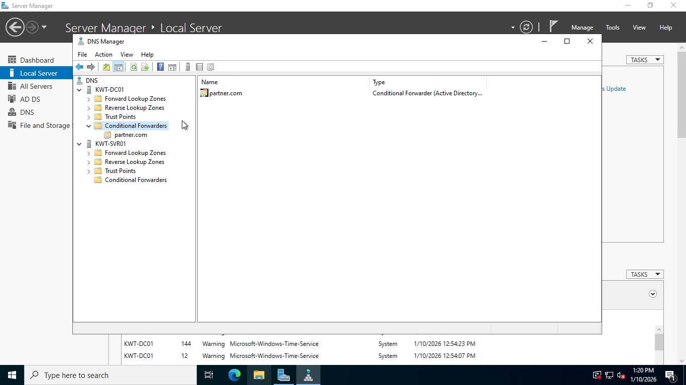 |

---

---

### Phase 5: DHCP Server Implementation (Simulated Environment)

In this phase, I configured the DHCP role on **kwt-SVR-1** to demonstrate IP address management and scope configuration. 
**Note**: This scope is created for simulation and documentation purposes to showcase infrastructure management skills.

### 1. DHCP Role Deployment
* **Server**: Installed and authorized the DHCP Server role on **kwt-SVR-1** within the **homelab.com** domain.

### 2. Experimental Scope Configuration (10.100.10.0/24)
* **Objective**: Demonstrating the ability to define logical network segments.
* **Exclusions**: Reserved `10.100.10.1` - `10.100.10.20` to simulate protection for static infrastructure.
* **Scope Options**:
    * **Default Gateway**: `10.100.10.100` (Simulated Gateway)
    * **DNS Server**: `192.168.8.100`
    * **DNS Domain**: `homelab.com`

### 3. Static IP Reservations
* **Scenario**: Configured a reservation for a network printer to demonstrate persistence in dynamic environments.
* **Configuration**: Reserved IP `10.100.10.200` using a simulated MAC address.

### Screenshots
| DHCP Scope & Exclusions | IP Reservation Setup |
|---|---|
| 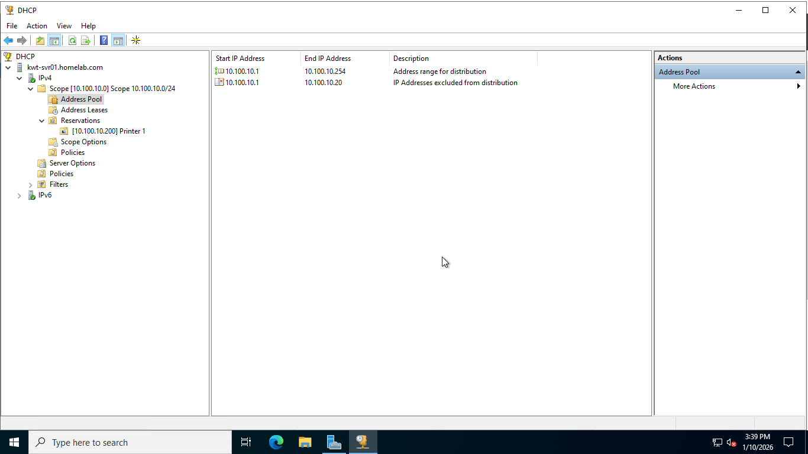 | 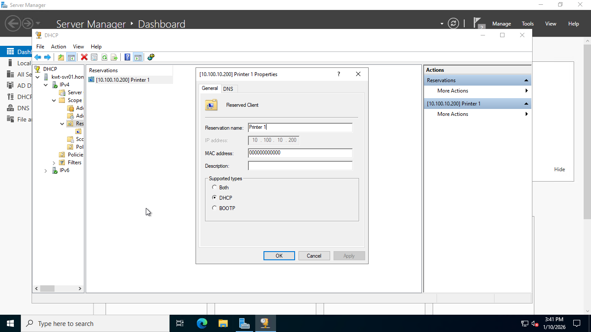 |

---
